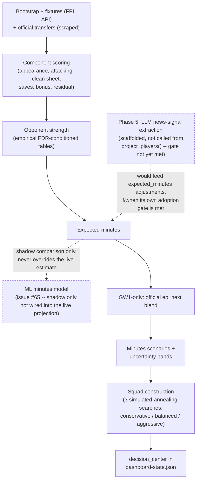

# Architecture

A visual companion to `README.md`'s "Hosted deployment" section and `MODEL.md`'s prose pipeline
description (issue #127) -- neither has a picture of how its pieces actually fit together, and
tracing that today means reading both docs plus several `plans/issue-*.md` files and the code
itself. Two diagrams: the system (this repo's runtime components and how they call each other),
and the projection model's own internal pipeline.

**Keeping this current**: if a change adds or removes a cross-component call -- a new endpoint, a
new GitHub Actions workflow, a new external dependency -- update the system diagram below as part
of that change. `.claude/skills/ship-issue/SKILL.md` carries this as an explicit step so it's
surfaced at the same point every such change already goes through, rather than silently drifting
(as this diagram's own first draft did mid-session, more than once, while it was being written).

## System

Every edge is labeled with the real mechanism -- endpoint, HTTP method, and the credential (if
any) that gates it -- not just a direction. **Solid** edges are HTTP calls; **dashed** edges cross
into the Railway persistent volume (the one place state actually survives between refreshes and
requests).

```mermaid
flowchart TB
    visitor["Visitor's browser"]

    subgraph gha["GitHub Actions (ephemeral runners -- no shared filesystem with Railway)"]
        scheduledRefresh["scheduled-refresh.yml<br/>(issue #101, hourly cron)"]
        deadlineReminder["deadline-reminder.yml<br/>(issue #55, hourly cron)"]
        liveCheck["live-regression-check.yml<br/>(issue #119, daily cron)"]
        releaseNotes["release-notes.yml<br/>(issue #143, twice-daily cron --<br/>12:00 &amp; 13:00 UTC, DST-safe 8am ET)"]
    end

    subgraph railway["Railway container"]
        server["server.py: create_server<br/>(issue #27)"]
        subgraph volume["Persistent volume (issue #27)"]
            profilesDb[("profiles.db")]
            artifacts[("dashboard-state.json,<br/>fpl-bootstrap-latest.json,<br/>official-transfers-latest.json,<br/>release-notes.json, ...")]
        end
    end

    fplApi[["FPL public API<br/>(bootstrap, fixtures, entry/history)"]]
    transferSources[["Scraped official transfer /<br/>club-news sources"]]
    smtp[["SMTP (Gmail)<br/>FPL_INTEL_SMTP_*"]]
    githubApi[["GitHub REST API<br/>(merged PRs; also this repo itself,<br/>for release-notes/ commits)"]]
    llmApi[["LLM API (optional)<br/>FPL_INTEL_RELEASE_NOTES_LLM_*"]]

    visitor -->|"GET /, /dashboard.html<br/>GET /api/status"| server
    visitor -->|"POST /api/profile, /draft-squad,<br/>/lookup-opt-out, /reminder-opt-in,<br/>/contact (open, per-source rate-limited)"| server
    visitor -->|"GET /api/reminder-confirm<br/>(one-time token in link)"| server

    server <-.->|"read/write"| profilesDb
    server <-.->|"read/write"| artifacts

    server -->|"send confirmation / contact<br/>notification email"| smtp

    scheduledRefresh -->|"live bootstrap fetch<br/>(decides whether to trigger,<br/>independent of Railway's own state)"| fplApi
    scheduledRefresh -->|"POST /api/refresh<br/>(X-Refresh-Token)"| server
    server -->|"fetch bootstrap/fixtures"| fplApi
    server -->|"fetch official transfers"| transferSources

    deadlineReminder -->|"live bootstrap fetch<br/>(deadline window check)"| fplApi
    deadlineReminder -->|"GET /api/shared-state<br/>(public, no token)"| server
    deadlineReminder -->|"GET /api/manager-view?team_id=<br/>(X-Refresh-Token rate-limit exemption)"| server
    deadlineReminder -->|"GET /api/reminder-teams<br/>(X-Reminder-Teams-Token, issue #105)"| server
    deadlineReminder -->|"send reminder email"| smtp

    liveCheck -->|"exercises every endpoint above<br/>with a reserved synthetic team ID"| server
    liveCheck -->|"IMAP poll: did the Contact Us<br/>notification actually arrive?"| smtp

    releaseNotes -->|"list merged PRs<br/>(GITHUB_TOKEN)"| githubApi
    releaseNotes -->|"generate copy<br/>(optional; template fallback if unset/fails)"| llmApi
    releaseNotes -->|"POST /api/release-notes<br/>(X-Refresh-Token)"| server
    releaseNotes -->|"git commit + push<br/>release-notes/&lt;date&gt;.md<br/>(contents: write --<br/>the one workflow with repo write access)"| githubApi

    classDef ephemeral stroke-dasharray: 4 3
    class gha ephemeral
```

**Why the two GitHub Actions workflows call back into Railway over HTTP instead of reading its
files directly**: a GitHub Actions runner is a fresh VM per run with no shared filesystem with
Railway's volume. Three issues independently hit this before it was recognized as one structural
gap and closed for good (issue #125): #101 (script needed live FPL data unrelated to Railway's own
state -- correct by design, not an instance of the bug), #122 (a script tried reading
`official-transfers-latest.json` from a local path that only ever existed on Railway), and #105
(a script tried reading `profiles.db` from a local path for the same reason). `/api/shared-state`
and `/api/manager-view` (issue #125) and `/api/reminder-teams` (issue #105) exist specifically so
every GitHub-Actions-hosted script reads Railway's live, already-computed state over HTTP instead
of assuming local file access it will never have.

## Model pipeline

Nested under `server.py`'s refresh call inside the system diagram above -- this is what actually
happens when `refresh.py`/`generation.py` recompute the shared dashboard state. See `MODEL.md` for
the full prose treatment of every stage; this is the shape only.

## See also

- `README.md`'s "Hosted deployment" section -- the prose walkthrough of getting a deployment running.
- `MODEL.md` -- the full prose treatment of every model-pipeline stage above, including exact
  formulas and coefficient provenance.
- `SPECIFICATION.md` -- the behavioral contract (what the app promises never to do, e.g. never
  auto-trigger its own actions).
- `plans/issue-105-reminder-teams-endpoint.md`, `plans/issue-125-single-source-of-truth.md` --
  the design history behind the GitHub-Actions-over-HTTP pattern shown above, for anyone who wants
  the full reasoning rather than just the resulting shape.
